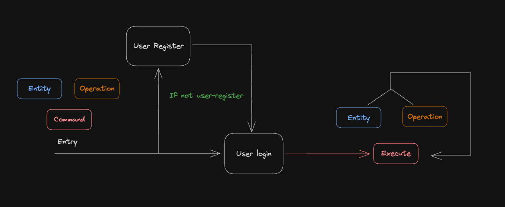

# Entities

---

## Category
### Properties:
- Title
- Color

### Behaviors:
- Create a new Category
- List User Categories with progress status
- Edit a category

---

## Task
### Properties:
- Title
- DueDate
- Category
- IsDone

### Behaviors:
- Create a new Task
- List User Today Tasks
- List User Tasks By Date
- Change Task status (done/undone)
- Edit a task

---

## User
### Properties:
- ID
- Email
- Password

### Behaviors:
- Register a user
- Log in user

---

# User Stories
### user related
- [X] User should be registered 
- [X] User should be able to log in to the application

### category related
- [X] User can create a new category 
- [X] User can Edit a category
- [X] User can see the list of categories

### task related
- [X] User can add a new task
- [X] User can Edit a task
- [X] User can see the List of its tasks
- [X] User can see the Today’s Tasks
- [X] User can see the Tasks by date
- [X] User can Done/Undone a task

### others
- [X] User can see progress status

---

# Flow

- Execution flow

